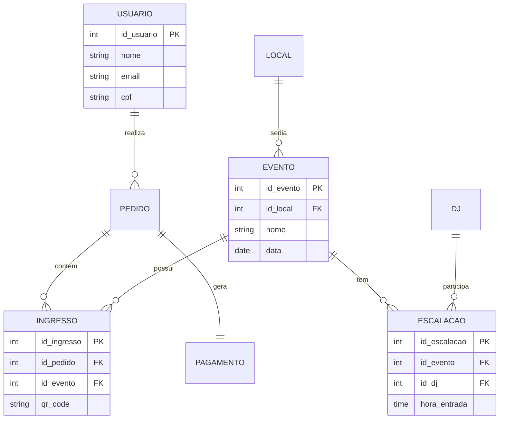

# Planta do Projeto

## Sumário

A planta do projeto é um arquivo que contém a estrutura do projeto, ou seja, as entidades, atributos e relacionamentos que serão utilizados no projeto.
O Projeto será sobre um site de compra de ingressos do evento Pineapple Paty, uma festa Rave importante para a cena eletrônica da cidade de Palotina. Tem como objetivo principal facilitar a compra de ingressos para o evento, além de fornecer informações sobre o evento, como a programação, os artistas, os ingressos, etc.
O Projeto será desenvolvido utilizando as seguintes tecnologias:

- Backend: Rust (Estudo sobre Engenharia de Software, dados sensiveis, como cpf e token de cartão etc e como funciona uma plataforma de compra de ingressos)
- Frontend: JavaScript, Trypescript e React (Estudo sobre Engenharia de Software, interface usando UX/UI, estudo de imagens 3d e sites interativos)
- Banco de Dados: PostgreSQL (Estudo sobre Engenharia de Software, dados sensiveis, como cpf e token de cartão etc)

### MER

#### 1. Usuário
- **ID_usuario** (PK)
- **Nome**, **Email**, **Senha** (Hashed/Argon2)
- **CPF**, **Telefone**
- **Data_Nascimento**, **Genero** (Para análise demográfica de IA)
- **Foto_Biometria** (Para controle de acesso/segurança)

#### 2. Evento
- **ID_evento** (PK)
- **ID_local** (FK)
- **Nome**, **Descricao**
- **Data**, **Hora_Inicio**
- **Status** (Ativo, Encerrado, Cancelado)

#### 3. Local
- **ID_local** (PK)
- **Nome**, **Endereco**, **Cidade**
- **Capacidade_Total** (Para controle de segurança)

#### 4. DJs
- **ID_dj** (PK)
- **Nome**, **Genero_Musical** (Importante para IA de recomendação)
- **Redes_Sociais**, **Status** (Ativo, Inativo)

#### 5. Escalação (Lineup)
- **ID_escalacao** (PK)
- **ID_evento** (FK), **ID_dj** (FK)
- **Hora_Entrada**, **Hora_Saida**
- **Palco** (Caso o evento tenha mais de um)

#### 6. Pedido (Transação)
- **ID_pedido** (PK)
- **ID_usuario** (FK)
- **Data_Pedido**, **Valor_Total**
- **Status_Pagamento** (Pendente, Aprovado, Recusado, Estornado)

#### 7. Ingresso (Item do Pedido)
- **ID_ingresso** (PK)
- **ID_pedido** (FK)
- **ID_evento** (FK)
- **Tipo_Ingresso** (Pista, VIP, Backstage)
- **Preco_Unitario** (Pode variar por lote)
- **QR_Code_Hash** (Segurança)
- **Status_Uso** (Nao_Utilizado, Utilizado, Cancelado)

#### 8. Pagamento & Tokenização
- **ID_pagamento** (PK)
- **ID_pedido** (FK)
- **Metodo_Pagamento** (Pix, Cartao_Credito)
- **Transaction_ID** (ID da API externa)
- **Token_Cartao** (PCI-DSS / LGPD - Armazenar apenas o token da API)
- **Nome_Titular_Cartao**
- **Data_Vencimento_Cartao** (Apenas mês/ano)

### DER Visual (Mermaid)

